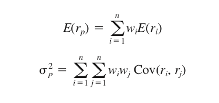
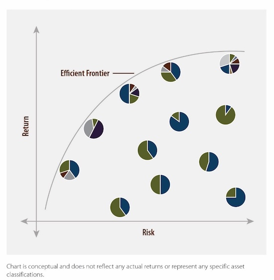

## Modern Portfolio Theory
Modern Portfolio Theory was first introduced in 1952 by Harry Markowitz in an essay entitled ["Portfolio Selection"](https://www.jstor.org/stable/2975974) and later, more extensively, in his book, ["Portfolio Selection: Efficient Diversification of Investments"](https://www.jstor.org/stable/j.ctt1bh4c8h). The theory provides a mathematical framework for constructing optimal investment portfolios and its central tenet is the efficient frontier, a graphical representation of all the possible efficient portfolios, i.e., those that offer the highest expected return for a given level of risk or, alternatively, the lowest risk for a given expected return.

For a multi-asset portfolio, the expected return and variance can be expressed as follows:

Where the expected return (E(r)) is the sum of the weighted returns and the variance (sigma squared) is the sum of the weighted covariance matrix. Markowitz showed that under certain conditions, an investor’s portfolio choice can be reduced to balancing these two dimensions. Through diversification, the risk of the portfolio, measured as its variance, depends not only on the individual variances of the returns on different assets, but also on the pairwise covariances of all assets.

At the most basic level, the theory provides a principled approach to constructing efficient portfolios, which reflect an optimal trade-off between risk and return.

## Multi-Asset Portfolio Optimization
I wrote a Python script that uses Modern Portfolio Theory to optimize a multi-asset portfolio composed of seven broad risk assets. The code begins by identifying the portfolio assets, defining the lookback period, and pulling data using Yahoo Finance. The script then runs a Monte Carlo simulation, generating 20,000 hypothetical portfolios with accompanying returns, volatility, and Sharpe Ratios. And finally, the script plots the efficient frontier, marking the maximum Sharpe Ratio portfolio (best risk-adjusted return) and minimum volatility portfolio (lowest standard deviation). 

Below is a chart, for illustration purposes only, of an efficient frontier for a multi-asset portfolio. 

The efficient frontier guides rational investors in selecting portfolios based on their risk tolerance, financial goals, and investment time horizon. For instance, risk-averse investors may prefer the more conservative portfolios with lower volatility, located on the lower end of the efficient frontier, whereas investors with a higher risk tolerance may consider the more aggressive portfolios with higher volatility, found on the higher end of the efficient frontier. Portfolios positioned below the efficient frontier should be avoided as they offer sub-optimal risk and return characteristics.

## Selected Assets
I've selected the following assets for the portfolio optimization. Note that any ETF provider can be used (BlackRock, Vanguard, State Street, etc.) as well as any asset or number of assets, assuming the asset is listed on Yahoo Finance.

* ITOT - iShares Core S&P Total U.S. Stock Market ETF
* IXUS - iShares Core MSCI Total International Stock ETF
* AGG - iShares Core U.S. Aggregate Bond ETF
* IAGG - iShares Core International Aggregate Bond ETF
* REET - iShares Global REIT ETF
* GSG - iShares S&P GSCI Commodity-Indexed Trust
* BTC-USD - Bitcoin

## Portfolio Assumptions
* Consists only of risk assets, consequently no Capital Allocation Line.
* Fully invested

## Model Assumptions
* Investors are rational.
* Investors are price takers.
* Asset returns follow a normal distribution.
* There are no taxes or transaction costs.

## Resources
* [The Python Standard Library](https://docs.python.org/3/library/)
* [Stack Overflow](https://stackoverflow.com)
